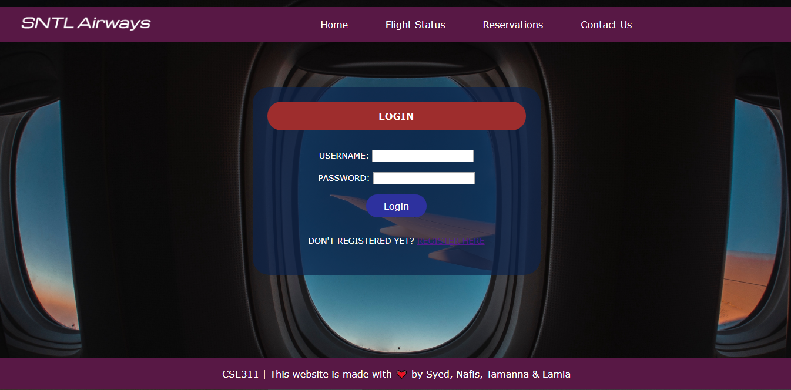
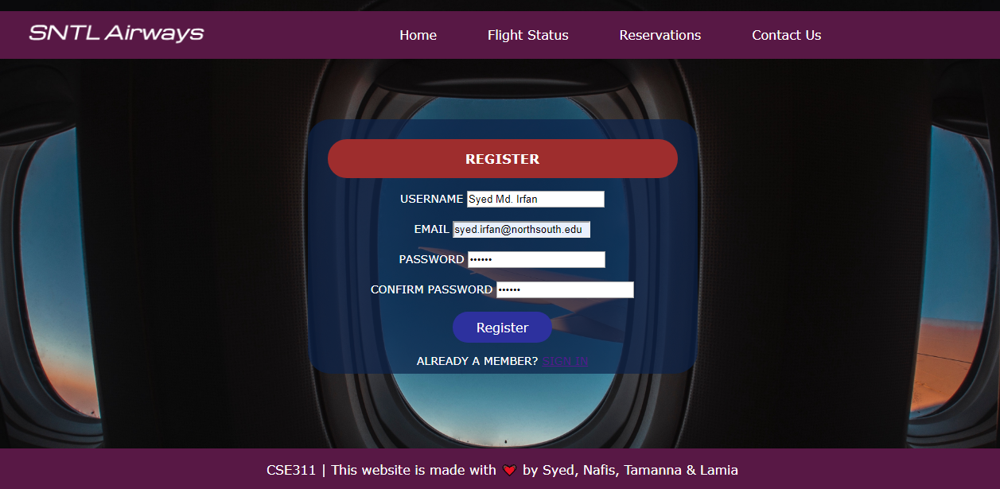
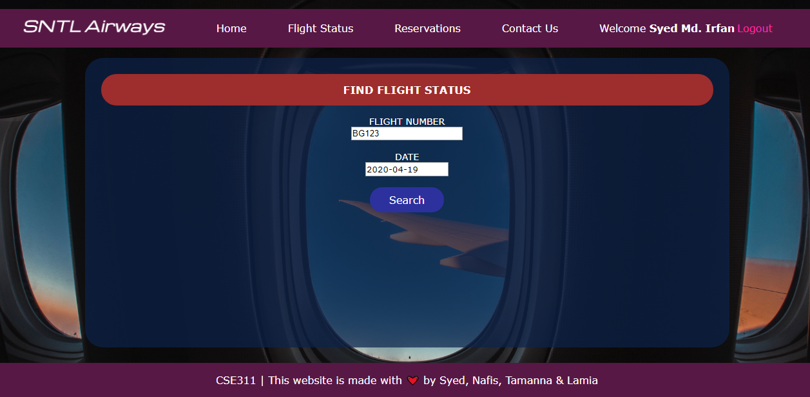
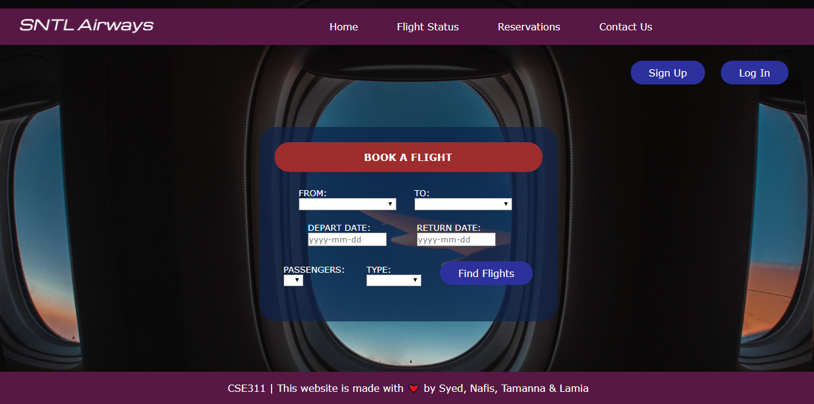

# Online Flight Booking - SNTL Airways

<table>
  <tr>
    <td> Language Uses </td>
    <td> HTML, CSS, php, MySql</td>
  </tr>
</table>

#### A simple website for booking flight online with the features described bellow. 
<table>
  <tr>
    <td> 1 </td>
    <td> Navigation Bar</td>
  </tr>
  <tr>
    <td> 2 </td>
    <td> User Login & User Registration Page</td>
  </tr>
  <tr>
    <td> 3 </td>
    <td> Search for Flights </td>
  </tr>
  <tr>
    <td> 4 </td>
    <td> Flight Status </td>
  </tr>
  <tr>
    <td> 5 </td>
    <td> Book a Flight </td>
  </tr>
  <tr>
    <td> 6 </td>
    <td> Reservations </td>
  </tr>
  
</table>

## Features

### Navigation Bar

 

### User Login Page

 

### User Registration Page

 

### Search for Flights

 

### Book a Flight

